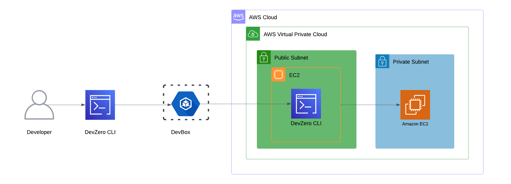

# EC2
Connecting to EC2 running in the private subnet of AWS VPC from your DevBox.

## Architecture Diagram:



## Existing EC2

### Step 1: Accessing EC2 from a DevBox

1. Follow the [Connecting to AWS](../../existing-network/connecting-to-aws.md) guide.
2. Go to **Amazon EC2 > Instances > Your Instance**.
3. Click on **Connect**. You will see the commands for accessing it.
4. Go to **DevBox** and make a copy of the key pair.
5. Connect to EC2 machine:\

```bash
ssh -i "path/to/key.pem" username@instance-ip
```



## New EC2 Machine

### Step 1: Creating an EC2 Instance

1. Follow the [Connecting to AWS](../../existing-network/connecting-to-aws.md) guide.
2. Go to **Amazon EC2 > Instances > Launch Instances**.
3. Enter name of the instance.
4. Use one of the [supported linux distros](https://web.archive.org/web/20230927004045/https://tailscale.com/kb/1017/install).
5. Choose **Instance type**.
6. Create a new **key pair** and save it.
7. In **Network settings**, click on **edit** and choose the VPC where your bastion host is running, the private subnet and the security group which allows inbound access to VPC.

### Step 2: Accessing EC2 from a DevBox
1. Go to **DevBox** and make a copy of the key pair.
2. Connect to this EC2 using ssh and the new key pair:\

```bash
ssh -i "path/to/key.pem" username@instance-ip
```



