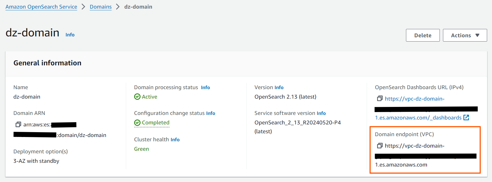

# OpenSearch

Connecting to OpenSearch running in the private subnet of AWS VPC from your DevBox.

## Architecture Diagram:


## Existing OpenSearch Service

### Step 1: Accessing OpenSearch from a DevBox

1. Follow the [Connecting to AWS](../../existing-network/connecting-to-aws.md) guide.
2. Go to **Amazon OpenSearch Service > Domains**.
3. Select your domain.
4. Copy **Endpoint**.


5. Go to your **DevBox**.
6. Connecting to the Cluster.

Run the following command To access the cluster:

```sh
curl -X GET "<opensearch-endpoint>:<port>/_cluster/health?pretty"
```


## New OpenSearch Service

### Step 1: Creating an OpenSearch Service

1. Follow the [Connecting to AWS](../../existing-network/connecting-to-aws.md) guide.
2. Go to **Amazon OpenSearch Service > Create domain.**
3. Give a unique **Domain name.**
3. Select **Standard create** in the **Creation method.**
4. Refer to [OpenSearch Documentation](https://docs.aws.amazon.com/opensearch-service/) for the Configuration.
5. Keep the **Data nodes** according to your requirements.
9. Go to **Network** section.
10. Choose your **VPC** and **Subnets**
11. In the next section, choose the **Security Groups.** Make sure the specified **Security Group** allows inbound connections.
11. Click on **Create.**

### Step 2: Accessing OpenSearch from DevBox
1. Go to your OpenSearch and copy **Domain endpoint.**



2. Go to **DevBox.**
3. Connecting to the Cache:
   `curl -X GET "<opensearch-endpoint>:<port>/_cluster/health?pretty"`


